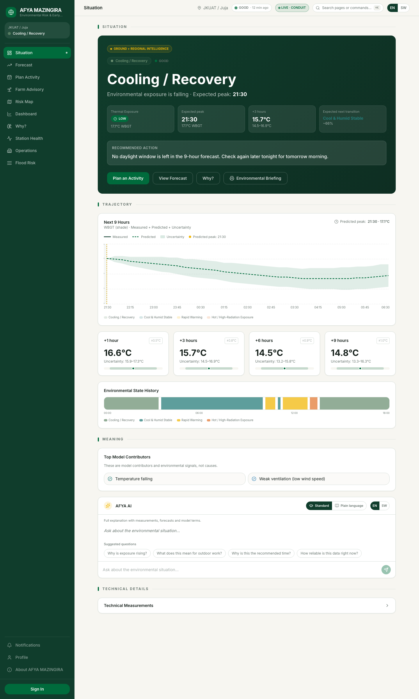
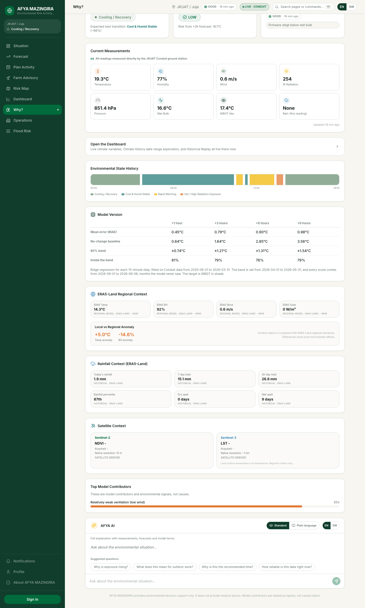
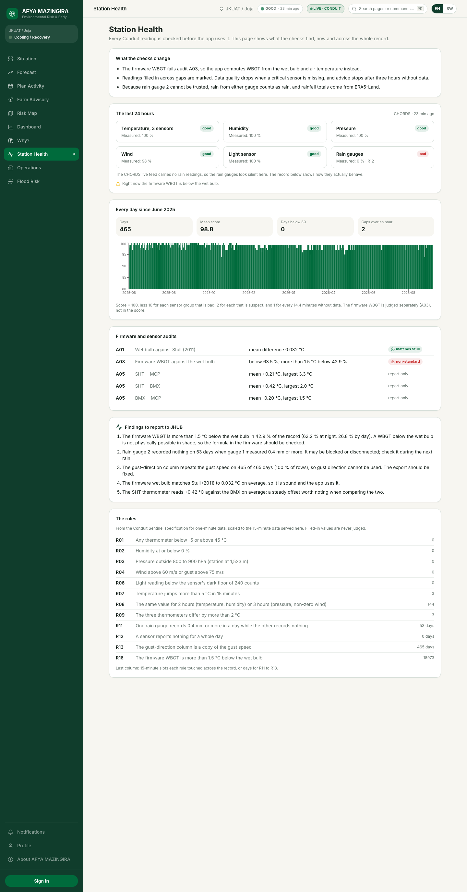
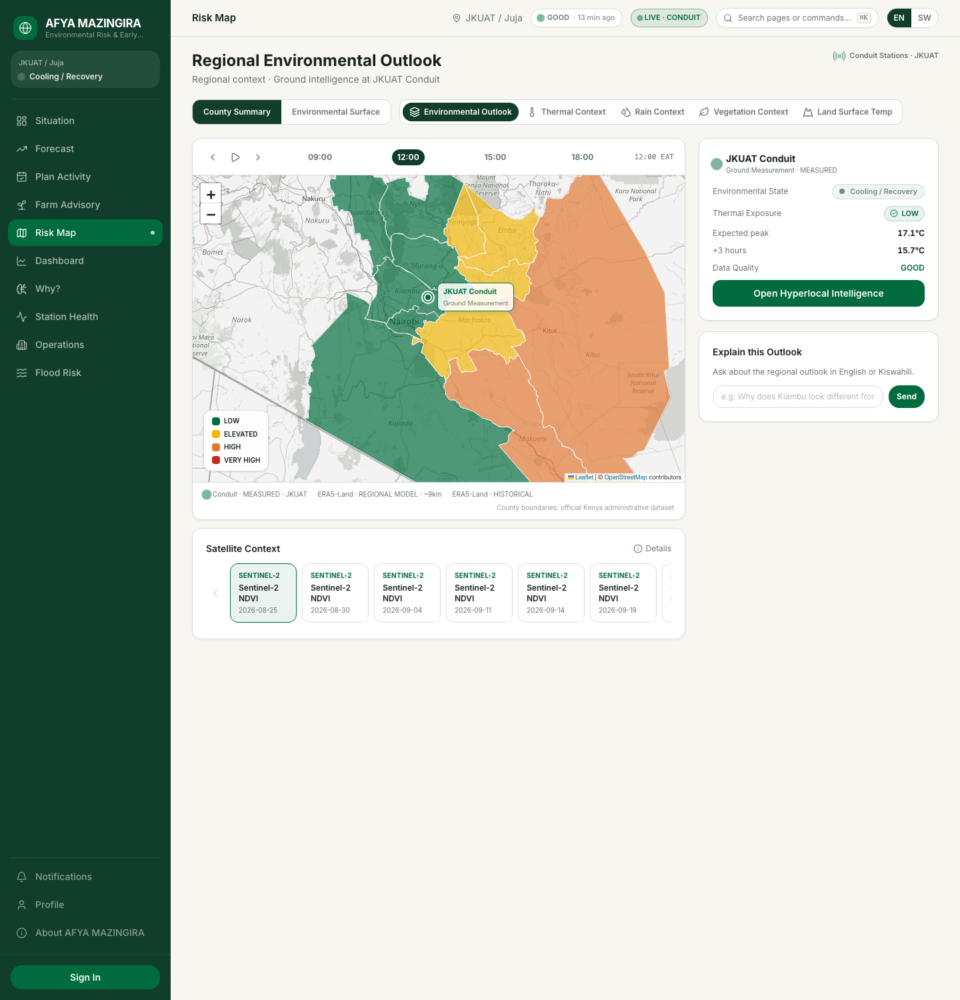
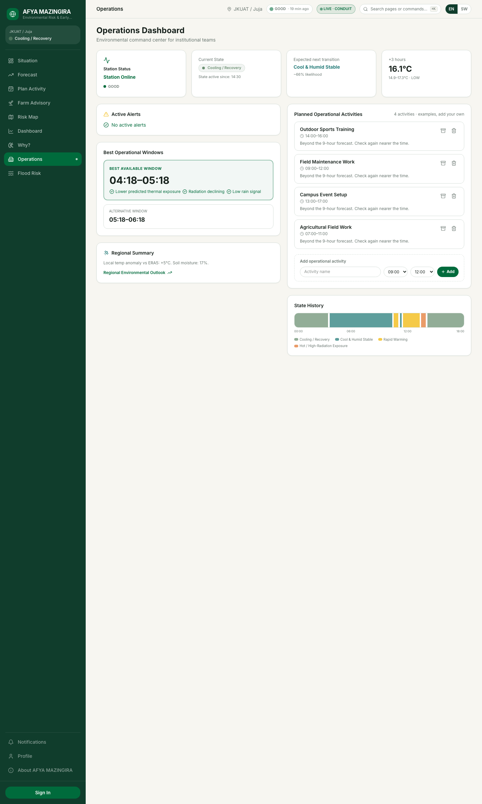

# Afya Mazingira

Heat and weather decisions for the JKUAT campus in Juja, Kenya, built on the Conduit@Empathy1 weather station.

Live at **[afya-mazingira.vercel.app](https://afya-mazingira.vercel.app)**. Built for Hack The Weather 2026 (JHUB Africa).

[](https://nextjs.org)
[](https://react.dev)
[](https://www.typescriptlang.org)
[](https://tailwindcss.com)
[](https://orm.drizzle.team)
[](https://vercel.com)
[](https://leafletjs.com)

---

## Table of contents

1. [Project name](#1-project-name)
2. [Problem statement](#2-problem-statement)
3. [Solution](#3-solution)
4. [How Conduit@Empathy data is used](#4-how-conduitempathy-data-is-used)
5. [Features](#5-features)
6. [Technology stack](#6-technology-stack)
7. [Architecture](#7-architecture)
8. [Installation and setup](#8-installation-and-setup)
9. [Usage](#9-usage)
10. [Data sources](#10-data-sources)
11. [AI usage](#11-ai-usage)
12. [Screenshots / demo](#12-screenshots--demo)
13. [Team members](#13-team-members)
14. [Future development](#14-future-development)
15. [Licence](#15-licence)
16. [Known limitations](#known-limitations)
17. [Reproducibility](#reproducibility)

---

**In one example.** A site supervisor in Juja is planning tomorrow's concrete pour. The station's own record shows how much the season matters: from January to March 2026 about half of all working hours were in the HIGH heat band for outdoor work, against about 3 % in July and August 2025. Afya Mazingira reads the station every 15 minutes, forecasts WBGT for the next nine hours, and tells the supervisor which daylight hours carry the least heat risk for construction, in English or Kiswahili.

---

## 1. Project name

**Afya Mazingira**, Kiswahili for "health of the environment".

## 2. Problem statement

**Heat already costs Kenya a great deal of outdoor work.** Heat exposure cost Kenya 1.1 billion potential labour hours in 2024, 51 hours per person, and agriculture accounted for 74 % of the loss. People had 424 more hours of heat-stress risk for moderate outdoor activity than in 1990 to 1999 [1].

**Around Juja the work is outdoors.** Quarrying building stone is one of Juja's most significant economic activities, alongside construction and farming [2]. In a study of Kenyan farmers wearing sensors, outdoor WBGT peaked between 14:00 and 15:00 [3].

**The station's own record shows how much the season matters.** Between 07:00 and 18:00 at JKUAT, shade WBGT reached 21 °C or more, the HIGH band for outdoor work, in 47 to 51 % of hours from January to March 2026, against about 3 % in July and August 2025. For construction the share was about 70 % from January to April. A tool tuned on the cool months would miss the risk; the 15-month archive does not.

**Water is short and used inefficiently.** Kiambu's own climate risk assessment lists erratic rainfall and water scarcity among the county's hazards, reports yield losses from low soil moisture and late rains, and records inadequate irrigation capacity [4]. Where Kenyan smallholders irrigate, efficiency is low: 201 small-scale irrigators in the Lake Naivasha basin reached 31 % water-use efficiency [5], and farmer-led irrigation rarely gets information support [6].

**The information people get is too coarse to act on.** Kenya Met defines heatwaves per town, for example three or more days above 32 °C for Nairobi [7]. The Kenya Agricultural Observatory Platform sends ward-level forecasts and advisories to about 250,000 farmers a month in five counties [8]. None of this says, for one site and one activity, which hours today are risky and when the work should move.

Users we have evidence for: outdoor workers and farmers around Juja. Users we think would benefit but have not yet asked: JKUAT sports coaches, campus grounds and events teams, and construction site supervisors.

## 3. Solution

Afya Mazingira turns the station's readings into decisions, in English and Kiswahili:

- **What is happening:** the current environmental state (cool and humid, rapid warming, hot, cooling), learned from 15 months of the station's own record and held for at least an hour before it counts as a change.
- **What comes next:** WBGT every 15 minutes out to nine hours, from the usual daily cycle at the station and today's departure from it, with an uncertainty band tested on months the model never saw.
- **What it means for you:** a risk band for the activity you choose (walking, sports, construction, field work, events) and the best daylight window to do it, never one that has passed or runs beyond the forecast.
- **For farms:** irrigation from a daily root-zone water balance: water when the zone has dried to what the crop can readily take up, with the depth to give and how much the zone still wants; otherwise the day it falls due. Crop water use comes from the station's measured daily high and low, against the station's own rain gauge. Spraying and field-work windows, crop heat stress and a planting outlook come with it.
- **Around the region:** hourly air temperature and shade WBGT for ten neighbouring counties from a regional forecast model, labelled as regional, next to Kiambu, where the station stands.

Every number is computed in code. Language models only reword results the code has already produced, and a checker rejects any reply that states a temperature, time or risk band the code did not.

## 4. How Conduit@Empathy data is used

The station (Conduit@Empathy1, JKUAT, lat -1.0997, lon 37.0145, 1,523 m) is the core of every output.

**Where the data comes from.** Three routes to the same instrument, in order of preference:

1. **Live, two feeds.** JHUB's Conduit API (needs a key) and the public live feed of the CHORDS portal the station reports to (instrument 61, no key). Both are asked and the one with the more recent observation wins.
2. **The recorded archive,** `data/conduit_master_2025_2026.csv`: 45,043 rows from 1 June 2025 to 8 September 2026. Each row is one sampled minute, about every 15 minutes. On every minute they share, the archive matches the organisers' one-minute files (28 August to 4 September 2026) to the second.
3. A synthetic series only if neither covers the time asked for, always labelled DEMO.

Past days after the archive ends (replay, climate history, the 30 days the forecast needs) come from the same live feeds.

**Cleaning.** Every source goes onto one 15-minute grid. Repeated timestamps are removed and counted. The station's missing-value code (-999.9) and physically impossible readings are treated as missing, and marked. Gaps up to 30 minutes are interpolated; longer ones are carried forward so the engines keep running, and every such value is marked as filled in. Gusts keep the slot's highest value and wind direction is averaged on the circle.

**Rain comes from the gauge's own counter.** A sampled minute's rain misses the other fourteen, so adding the samples up gives 76 mm over the archive. Gauge 1 also reports a running total for its day (reset at 06:00 UTC), and the rise in that total gives **1,185 mm**, against 1,199 mm from the gauge's own end-of-day totals (the difference fell before the archive's first row). The wettest day on record, 27 April 2026, had 95.2 mm. Gauge 2 is used only where gauge 1 has no reading, never added to it. Data quality is GOOD, DEGRADED (over an hour old, or a critical reading filled in) or POOR (over three hours old), and POOR suppresses recommendations.

**Conduit Sentinel: station health first.** Conduit Sentinel is the quality-control core of the project: rules, audits and a daily health score written for this station's exports and applied here to the 15-minute data. A reading that breaks a hard limit is dropped before the engines see it; the rest of the checks set the day's score and the data quality the app acts on.

| Check | What it flags |
|---|---|
| R01 to R05 | Temperatures outside -5 to 45 °C, humidity outside 0 to 100 %, pressure outside 800 to 900 hPa (the station is at 1,523 m), impossible wind or gusts, rain outside 0 to 10 mm in a reading. Such a value is dropped before anything reads it, and marked |
| R06 | Light readings below the sensor's dark floor of 240 counts |
| R07 | Any of the three thermometers jumping more than 5 °C in 15 minutes |
| R08 | The same value for 2 hours (a thermometer, only while one of the other two moves by more than 0.5 °C; humidity) or 3 hours (pressure, non-zero wind) |
| R09 | The three thermometers disagreeing by more than 2 °C |
| R10 | A gust reported below the wind speed it gusts above, caught on the reading itself |
| R11 | In a rain day, one gauge's own total is 0.4 mm or more while the other's is zero. It is reported against the date the rain day starts, 06:00 UTC |
| R12 | A channel silent for a whole day (Nairobi time), or flagged in every reading of it. On the CHORDS feed, which sends rain only while it rains, the gauges are not judged until one reports |
| R13 | The gust-direction column copying the gust speed, judged on the readings that carry a gust |
| R14 | Cadence: a reading arriving a whole interval late, or inside a gap. Reported, never scored |
| R15 | A non-zero device health code. This export carries no such column, so the check reports itself as not reported rather than passing; where a feed sends one, a code is noted and never counted as a fault, its meaning being undocumented |
| R16 | The firmware WBGT more than 1.5 °C below the wet bulb |
| A01 to A05 | Audits: the firmware wet bulb against Stull (2011), the firmware heat index against the NWS Rothfusz regression, the firmware WBGT against the wet bulb, the firmware WBGT against a standards-grade estimate (Liljegren et al. 2008), and the three thermometers against each other |
| Daily score | 100, less 10 for each group that is bad, 2 for each that is suspect, and 1 for every 14.4 minutes without data. The groups are the three thermometers, humidity, pressure, wind, light, and each rain gauge on its own. Missing time follows the feed's own cadence: a gap opens when a reading is more than four minutes later than the spacing the feed keeps (906 s in the archive, 900 s from CHORDS, 61 s in the organisers' one-minute exports), and is charged from one interval after the last reading |

Where it lives: the rules in `src/lib/afya/sentinel.ts`; `npm run station-report` runs them over the whole archive into `src/lib/afya/model/station-health.json`; `/api/station-health` serves that report and the same checks live on the last 24 hours; the **Station Health** page shows both; `tests/sentinel.test.ts` tests them.

What it changes in the app:

- a sensor group that fails the rules over the last 24 hours lowers data quality, which widens the forecast band or suppresses recommendations;
- the firmware WBGT fails audit A03, so WBGT is computed from the wet bulb and air temperature instead;
- the firmware wet bulb passes audit A01, so the app uses it;
- values filled in over gaps are never judged as good and never used to fit the models.

Over the 466 days on record (Nairobi days):

- a mean daily score of 89.5 and no day below 80. The gust-direction copy (R13) is bad every day, as the Sentinel specification counts it, so 90 is the best any day scores. That score leaves out the battery, because this export carries no battery channel to judge; counting it as the specification does, the mean is 79.5, no day reaches above 80 and 112 fall below it. The page shows both;
- 320 minutes without data, on 12 days; two gaps longer than an hour, the longest 1.6 hours (27 August 2026, 20:02 to 21:38 UTC);
- the firmware WBGT is below the wet bulb in 63.5 % of readings and more than 1.5 °C below in 42.9 % (62.2 % at night, 26.8 % by day);
- the firmware heat index matches the NWS Rothfusz regression to 0.101 °C on average, and to 0.034 °C over the readings at or above 27 °C the formula is built for (A02). The largest single difference, 1.058 °C, sits on the 80 °F switch between the simple form and the regression;
- the firmware WBGT reads below a standards-grade estimate at every hour of the day (A04): about 2 °C at night, 8.6 °C at 09:00 EAT, 3.99 °C over the record. The gap follows the sun rather than the temperature peak. The estimate needs solar irradiance the station does not measure, inferred from the SI1145 infrared counts, so the daytime figures carry real uncertainty (held-out r² 0.674, RMSE 155 W/m², worth 1.1 to 2.0 °C of WBGT); the night-time gap uses no irradiance at all. The firmware's column matches none of the usual conventions: against the archive it differs from the wet bulb alone by 1.92 °C on average, from 0.7 × wet bulb + 0.3 × air (ISO 7243 without solar load) by 1.99 °C, and from the Liljegren estimate by 4.05 °C;
- by each gauge's own daily totals, gauge 2 recorded nothing on 85 rain days when gauge 1 measured 0.4 mm or more, and gauge 1 nothing on 16 days when gauge 2 did;
- since 1 July 2025 the records carry the UV index in gauge 2's running-total column, so gauge 2's running total is lost and only its daily totals remain;
- the archive export has no battery channel; the CHORDS feed lists one but leaves it empty, which counts as bad (R12);
- the firmware wet bulb agrees with Stull (2011) to 0.032 °C.

These go on the page as findings to report to JHUB. The same checks also run live, unchanged, on other 3D-PAWS stations on the CHORDS portal: the page's station selector adds KALRO Thika, Machakos Stoni Athi and Embu, and any other instrument on the portal would need only its id.

**WBGT from the station's own sensors.** The station's firmware WBGT column reads below the wet bulb in 63.5 % of the archive, which a real WBGT cannot do. We do not use it. WBGT here is the ISO 7243 form without solar load, 0.7 x wet bulb + 0.3 x air temperature, from the station's wet bulb and its air temperature.

**Environmental states.** k-means with four clusters on the archive's training months, named by their centres. A new state counts only after it has held for an hour, which takes the changes from 9.4 a day (mostly clouds passing) to 4.0.

| State | Mean air temperature | Humidity | Temperature change | Typical time |
|---|---|---|---|---|
| Cool and humid, stable | 16.4 °C | 84 % | -0.1 °C/h | 05:00 |
| Rapid warming | 23.0 °C | 60 % | +2.2 °C/h | 10:00 |
| Hot, peak heat | 27.0 °C | 45 % | +0.2 °C/h | 14:00 |
| Cooling, recovery | 20.9 °C | 64 % | -1.2 °C/h | 19:00 |

The "next state" shown on the page is the one that most often followed the current state at the same time of day (in three-hour blocks), with how often it did and the typical wait. On April to September 2026, held out of the fit, it names the next state correctly 94.9 % of the time, and the typical wait is off by a median of 0.7 hours.

**Forecast.** `npm run evaluate` tests four forecasts month by month: each month from October 2025 to September 2026 is forecast by models refitted on everything recorded before it, with the usual daily cycle taken only from the 30 days before each forecast. Mean error / RMSE / share inside the 80 % band:

| Forecast | +1 h | +3 h | +6 h | +9 h |
|---|---|---|---|---|
| No change | 0.68 / 0.94 / 81 % | 1.69 / 2.15 / 82 % | 2.93 / 3.50 / 82 % | 3.69 / 4.33 / 82 % |
| **Seasonal anomaly (shipped)** | **0.45 / 0.62 / 80 %** | **0.69 / 0.90 / 81 %** | **0.82 / 1.06 / 82 %** | **0.86 / 1.12 / 82 %** |
| Ridge regression, 25 inputs | 0.52 / 0.70 / 80 % | 0.88 / 1.14 / 83 % | 0.97 / 1.25 / 84 % | 1.07 / 1.38 / 83 % |
| Ridge with the seasonal terms | 0.45 / 0.62 / 81 % | 0.70 / 0.92 / 84 % | 0.85 / 1.11 / 87 % | 0.90 / 1.17 / 88 % |

The seasonal anomaly model beats the 25-input ridge in all 12 months at every horizon, and ties the ridge that also has its terms, so the simpler model ships: the usual WBGT for the target's 15-minute time of day over the last 30 days, plus the current departure from usual times a factor fitted for each step ahead. Its band is the 80th percentile of the errors on held-out months, for each step and each three-hour block of the day. In the hot season (January to March 2026) it scores 0.48 / 0.75 / 0.90 / 0.96 °C, stays inside its band 79 % of the time, and puts the hour in too low a risk band 8.5 % of the time at +3 hours (17.1 % with the ridge).

On a single split (fitted to May 2026, tested on June to September 2026, which the fit never saw):

| Lead time | Mean error | Assuming no change | 80 % band | Inside the band | Same risk band | Band too low |
|---|---|---|---|---|---|---|
| +1 h | 0.43 °C | 0.64 °C | ±0.70 °C | 82 % | 92.2 % | 4.1 % |
| +3 h | 0.69 °C | 1.64 °C | ±1.09 °C | 80 % | 88.4 % | 5.8 % |
| +6 h | 0.86 °C | 2.85 °C | ±1.31 °C | 79 % | 85.6 % | 7.8 % |
| +9 h | 0.90 °C | 3.57 °C | ±1.39 °C | 79 % | 85.4 % | 7.5 % |

`npm run fit` refits the forecast, the states and the rain chance from the archive through the same cleaning and feature code the app runs.

**Rain chance.** A logistic model of whether gauge 1 records rain in the next three hours, from humidity, pressure and temperature changes, the time of day and recent rain, fitted to the gauge's counter rain. Tested month by month, its Brier score is 0.055 against 0.072 for each month's own rain frequency (skill +0.24). When it says 50 % or more, it rained 84 % of the time.

**Farm advisory.**

- Reference evapotranspiration (ET₀) is Hargreaves (FAO-56 eq. 52) from the highest and lowest air temperature the station measured over the last 24 hours, and the sun's energy for JKUAT's latitude and the date (eq. 21). Over the 465 days of the archive it runs 0.43 mm/day above Open-Meteo's FAO-56 Penman-Monteith ET₀ (mean absolute difference 0.51, RMSE 0.65), which is what Hargreaves does at a site whose measured daily range is wider than the reanalysis grid's; the page shows both figures side by side.
- The irrigation advice is the FAO-56 chapter 8 root-zone balance, carried day by day over the last 60 days: depletion rises with crop water use (ET₀ times the crop coefficient for the stage) and falls with effective rain (80 % of each day's rain above 2 mm), held between an empty zone and a full one. Rain comes from gauge 1 when it reported on at least 6 of the last 7 days, otherwise from Open-Meteo's regional model, and the page says which.
- Water is advised when the zone has dried to the readily available water it holds (FAO-56's p, corrected for the day's demand). The depth refills the zone, floored to 5 mm; a single pass is held to the readily available water, because more than that runs off clay or drains past the roots, and the page says how much the zone still wants. Below that point the page gives the day the watering falls due instead of a depth. A hold for rain needs a forecast that covers most of the refill, not any rain at all.
- The balance also counts irrigation the farmer records on the page: a pass is entered as a date and a depth, and comes off the depletion that day. A recorded pass counts in full where rain counts at its effective share, because water put on the root zone loses only the surplus past field capacity. The record is held on the device that made it, so it works signed out and nothing about a field is stored on the server. Where the record is too thin to carry a balance, the page gives the week's requirement instead of an instruction.
- Crops that dry down before harvest are not watered at maturity, and heat stress uses each crop's own cardinal temperatures.
- Regional soil moisture (ERA5-Land, 7 to 28 cm) is shown as context only, ranked against its own past year. The page marks the whole advisory as indicative.
- What it comes to: over 1 June to 8 September 2026, the dry season, the advice for maize in its vegetative stage is 320 mm in five waterings against 338 mm of crop demand, at an interval of 18.8 days where FAO-56's own figures give 19.7. Beans at maturity are left to dry down.

**Regional outlook.** Kiambu, where the station stands, uses the station: its measured temperature for hours already past and its forecast WBGT for the outlook. The other ten counties use Open-Meteo's forecast model through the same shade WBGT (with Stull's wet bulb), labelled as regional. The Thermal layer colours each county by its air temperature at the chosen hour.

## 5. Features

| Page | What it does |
|---|---|
| **Situation** | The current state, readings (filled-in values marked), data quality with the time of the data, the risk band now beside the band forecast for +3 hours, the +1/+3/+6/+9 h forecast with each horizon's tested error, the best daylight window for an activity, and the AI explanation |
| **Forecast** | The station's measured WBGT over the last 12 hours joined to the 15-minute forecast and its band, shaded by state |
| **Plan Activity** | Best-time search for an activity, duration and time window: only windows still ahead, in daylight and fully covered by the forecast, with reasons that hold for that window, an alternative, and saved plans that can be edited and rerun |
| **Farm Advisory** | Water now (with the depth and what the zone still wants), hold for rain, nothing needed yet (with the day it falls due), or too little data (with the week's requirement), from the root-zone balance; spray and field-work windows, crop heat stress and planting outlook for 7 crops and 4 growth stages; marked indicative |
| **Risk Map** | Leaflet on OpenStreetMap: 11 county boundaries with outlook, thermal (air temperature), rain and vegetation layers and a time slider; station-backed versus regional marked on each; grey where a source has no data |
| **Dashboard** | Live station variables and daily station rain, a climate history explorer over any date range (station or ERA5), and historical replay of any day from June 2025 to yesterday: step through the day with the future hidden, then reveal each forecast against what the station recorded |
| **Station Health** | Conduit Sentinel: sensor-group status for the last 24 hours at JKUAT or three nearby CHORDS stations, the daily health score since June 2025, firmware and thermometer audits, the rules, and findings to report to JHUB |
| **Why?** | Data quality flags, the state timeline, what moves the +3 h forecast in °C, the model comparison table with test-month scores, and the regional context with the hours it compares |
| **Operations** | A day's planned activities, saved in the browser, each judged on the part of its window still ahead and forecast, with a cooler daylight window suggested when there is one |
| **Flood Conditions** | Today's rainfall (so far plus forecast) and 0 to 7 cm soil saturation by county from Open-Meteo, with the thresholds printed on the page. Kiambu's rain is the station gauge where the gauge covered the day. Conditions only; not a flood forecast |
| **Notifications** | Alert rules checked once a day at 08:00 EAT: the day's forecast heat peak for the rule's activity, a hot state ahead, or a saved plan moving into a higher band. Sent by email, and by browser push where the server has VAPID keys |
| **Briefing** | A printable one-page summary, rendered on the server |

Also: sign-in with email and password or Google, email verification, rate limits on sign-in, sign-up and the AI, a ⌘K command palette, and an installable app that shows the last known situation offline.

## 6. Technology stack

| Layer | Choice |
|---|---|
| App | Next.js 16 (App Router), React 19, TypeScript, Tailwind CSS 4 |
| Charts and maps | Recharts, Leaflet with react-leaflet |
| Data | PostgreSQL with Drizzle ORM (Neon in production); optional, the station pages run without it |
| Models | Seasonal-anomaly forecast, k-means states, logistic rain chance, all fitted in TypeScript by `scripts/fit-models.ts` |
| Language models | Gemini, then Groq, OpenAI and Anthropic, then written templates; about 8 seconds in all |
| Email and push | Resend, Web Push (VAPID) |
| Hosting | Vercel, with a daily Vercel Cron job for alerts |
| Checks | TypeScript, ESLint, Node's test runner via tsx, GitHub Actions |

## 7. Architecture

Three real, redundant station feeds and Sentinel's quality checks feed one deterministic pipeline. A language model only rewords what the pipeline has already computed — it never produces a number, a time or a risk band itself.

```
┌───────────────────────────────────────────────────────────────────────┐
│ INGESTION   Conduit API · CHORDS live · Archive CSV                   │
│             (the freshest live feed wins; history past the archive    │
│              comes from the same feeds)                               │
└───────────────────────────────────┬───────────────────────────────────┘
                                    ▼
┌───────────────────────────────────────────────────────────────────────┐
│ CLEAN + CHECK   15-minute grid · duplicates counted · gaps marked     │
│                 rain from gauge 1's counter · Sentinel QC · shade WBGT│
└───────────────────────────────────┬───────────────────────────────────┘
                                    ▼
┌───────────────────────────────────────────────────────────────────────┐
│ FEATURES   level, 1 h change and mean, the usual value for the time   │
│            of day over the last 30 days                               │
└───────────────────────────────────┬───────────────────────────────────┘
                                    ▼
┌────────────────────────────┐        ┌───────────────────────────────┐
│ STATE   k-means, 4 clusters │        │ FORECAST   usual daily cycle  │
│ held for an hour to count   │        │ + today's departure, per step │
└──────────────┬──────────────┘        └───────────────┬───────────────┘
               └──────────────────┬───────────────────┘
                                   ▼
┌───────────────────────────────────────────────────────────────────────┐
│ DECISION   risk band per activity · best daylight window ·            │
│            farm water budget · rain chance · alert rules              │
│            (also fed by ERA5, Open-Meteo and Sentinel-2 for the       │
│             regional map and context)                                 │
└───────────────────────────────────┬───────────────────────────────────┘
                                    ▼
┌───────────────────────────────────────────────────────────────────────┐
│ DELIVERY   pages · printed briefing · email + push alerts             │
│            language model rewords the result above — never computes  │
│            one — and a checker rejects anything it states that the   │
│            pipeline didn't                                            │
└───────────────────────────────────────────────────────────────────────┘
```

Code: `src/lib/afya/` holds the engines (`sources`, `station-history`, `sentinel`, `data-quality`, `feature-engine`, `climatology`, `state-engine`, `forecast-engine`, `risk-engine`, `best-time-engine`, `farm-engine`, `alert-engine`, `explanation`, `grounding`), `src/lib/afya/model/` the fitted models, `src/app/` the pages and API routes, `scripts/` the model fit and evaluation, the station report and the database seed, `tests/` the tests.

## 8. Installation and setup

Requires Node.js 20.9 or later.

```bash
npm install
cp .env.example .env
npm run dev
```

The app runs with an empty `.env`: station data comes from the public CHORDS feed, or the committed archive when offline, and answers use the written templates. `.env.example` explains each variable. For sign-in, saved plans and alerts, set `DATABASE_URL` to a PostgreSQL database and create the tables:

```bash
npm run db:push
```

Deploying to Vercel: import the repository, add the Neon integration (it sets `DATABASE_URL`), add the variables from `.env.example` including `CRON_SECRET` (and `VAPID_PUBLIC_KEY` / `VAPID_PRIVATE_KEY` for browser push, made with `npx web-push generate-vapid-keys`), run `npm run db:push` once against the production database, and set `NEXT_PUBLIC_APP_URL` to the deployed address.

## 9. Usage

Open the app and start at **Situation**. Choose an activity to see its risk and best window; open **Why?** to see where each number comes from.

| Command | What it does |
|---|---|
| `npm run dev` | Development server on http://localhost:3000 |
| `npm test` | 335 tests, no network |
| `npm run typecheck` / `npm run lint` | Type check and lint |
| `npm run fit` | Refit the forecast, the states and the rain chance from the archive |
| `npm run evaluate` | Test the four forecasts month by month |
| `npm run station-report` | Rerun the station health checks over the archive |
| `npm run build` | Production build |

Main API routes (JSON):

| Route | Returns |
|---|---|
| `GET /api/situation` | The whole pipeline output: readings, quality, state, forecast, risk, best time, context. `?activity=` sets the activity |
| `GET /api/forecast` | Forecast horizons and the 15-minute series with bands |
| `POST /api/recommendations` | Best window for `{activity, duration_minutes, window_start, window_end}` |
| `POST /api/farm` | Advisory for `{crop, stage}` |
| `POST /api/replay` | Hour-by-hour replay of a past day `{date}`, each forecast against what the station recorded |
| `GET /api/map` | County indicators by hour, with their sources |
| `GET /api/station-health` | The archive health report and the same checks on the last 24 hours; `?instrument=10` runs them on another CHORDS station |
| `GET /api/climate-history` | Any date range, daily or hourly, station or ERA5 |
| `GET /api/health` | Whether the app is up, and whether it has a database |

## 10. Data sources

| Source | Used for | Credit and terms |
|---|---|---|
| Conduit@Empathy1, via JHUB's Conduit API | Live station readings and history past the archive | JHUB Africa (JKUAT) and SPACE-SI. Access by API key |
| Conduit@Empathy1 on the UCAR 3D-PAWS FEWS NET CHORDS portal, instrument 61 | Live station readings and history past the archive | Public live feed. CHORDS: Daniels et al. (2014), doi:10.5065/d6v1236q |
| Conduit archive, `data/conduit_master_2025_2026.csv` | Model fitting, fallback, history, replay | Exported from the Conduit dashboard |
| The organisers' Hack The Weather files (one-minute exports, 28 August to 4 September and 11 to 15 September 2026) | Checking the archive by hand: on every minute they share (28 August to 4 September) the archive matches them to the second | JHUB Africa |
| ERA5 via the Open-Meteo archive API (`models=era5`, about 28 km, about 5 days behind) | Regional context at the station's hour of day, climate history | Open-Meteo, CC BY 4.0. Contains modified Copernicus Climate Change Service information |
| ERA5-Land via the Open-Meteo archive API | Regional soil moisture at 7 to 28 cm, as context on the Farm page | Open-Meteo, CC BY 4.0. Contains modified Copernicus Climate Change Service information |
| Open-Meteo forecast API | County map and Thermal layer, Flood page, rainfall context up to today, the farm's regional rain and Penman-Monteith ET₀, plans past the station forecast | Open-Meteo, CC BY 4.0 |
| Copernicus Sentinel-2, via the Copernicus Data Space | NDVI and acquisition dates | Contains modified Copernicus Sentinel data |
| County boundaries, `public/geo/counties.geojson` | Map | **TO DO (team): record where this file came from.** It holds 11 polygons carrying the official KNBS county codes, but its own origin is not recorded, so neither this table nor the map footer claims one |
| Landing page photographs | Decoration | Unsplash licence |

Methods: Stull (2011), *J. Appl. Meteor. Climatol.* 50, 2267-2269 (wet bulb); ISO 7243 (WBGT); Hargreaves and Samani (1985) and FAO-56, Allen et al. (1998) (reference evapotranspiration, extraterrestrial radiation, crop coefficients and water balance).

## 11. AI usage

The AI tool used in this project is Anthropic's Claude: Claude Code, and Claude in Cowork during planning. It was used for debugging and explaining code errors, for writing code, tests and documentation, and for research and data analysis. The team reviewed and ran every change and can explain each part of the solution.

## 12. Screenshots / demo

Demo video: _link to be added_











## 13. Team members

| Member | Role |
|---|---|
| **Vincent Kongo** ([@vinnienovah](https://github.com/vinnienovah)) | Data scientist and environmental specialist |
| **Phillip Muchemi** | Data scientist and GIS specialist |
| **George Kamundia** ([@GKamundia](https://github.com/GKamundia)) | Computer scientist, machine learning and AI specialist |

Between them the team covers the environmental science behind the heat and farm advice, the GIS behind the regional map and county boundaries, and the machine learning behind the forecast, the environmental states and the station health checks.

## 14. Future development

- **Add the sun to WBGT.** Calibrate the station's light sensor to irradiance so direct-sun WBGT can be computed, not only shade WBGT.
- **More stations.** The station health checks already run on any 3D-PAWS station on the CHORDS portal (75 instruments in Kenya); the forecast needs each station's archive to refit with `npm run fit`.
- **Refit monthly** as the archive grows, and publish the scores each time.
- **Reach people without a smartphone.** Send the daily best window and heat alerts by SMS and WhatsApp. The first partner to approach is the Kiambu county agricultural extension service, which already advises farmers around Juja.
- **CHIRPS rainfall** by point extraction from its gridded files, as regional context beside the station's gauge.
- **Partners:** JHUB Africa for station access and the export fixes the station health findings point to, Kiambu county agriculture officers for the farm advisory, and the JKUAT sports and estates departments as first users.
- **Localize by location.** Use GPS (or a chosen pin, backed by Conduit/CHORDS station coverage and regional data) so someone can select where they are and get a localized picture, rather than only JKUAT and the fixed 11-county list.
- **More datasets on the Risk Map.** Bring in further regional layers — air quality, a drought index, additional satellite products — so the map covers more than heat, rain and vegetation.

## 15. Licence

MIT. See [LICENSE](LICENSE). Station and reanalysis data remain under their providers' terms (section 10).

One file carries a second licence: `src/lib/afya/liljegren.ts` implements the heat-balance equations of WBGT version 1.1 by James C. Liljegren, Copyright © 2008 UChicago Argonne, LLC, and keeps that program's open-source notice in full at the head of the file, as its terms require.

---

## Known limitations

- **WBGT is shade WBGT.** It leaves out direct sun because the station's light sensor is not calibrated to irradiance. In full midday sun WBGT is several degrees higher, so the bands understate risk for work in the open.
- **The risk bands are our own.** 18, 21 and 24 °C WBGT and the activity adjustments are screening bands chosen by the project, not a published occupational or medical limit. In Juja's climate the top band is rare in shade (0.05 % of the archive).
- **The forecast under-warns a little more in the hot season.** Tested month by month, it put the hour in too low a band at +3 hours 8.5 % of the time from January to March 2026, against 7.4 % in other months.
- **Heat alerts use the 08:00 forecast of the day's peak,** which runs on average 0.85 °C below the peak the station then measures, so some days that turn out HIGH get no alert.
- **Farm advice is indicative.** It assumes a clay soil typical of JKUAT, not a measurement in the field, and uses the regional model's rain when the gauge is short of data. The root-zone balance counts rain and whatever irrigation you record on the page; water you applied without recording is not in the depletion it shows.
- **The flood page shows conditions,** rainfall and soil saturation, not a flood forecast.
- **The Conduit API can lag by most of a day;** the CHORDS feed covers for it. CHORDS sends rain only while it rains, so its rain gauges are not judged on a dry day.
- **Browser push needs VAPID keys** on the server; without them alerts go by email only.
- **Rate limits are per server instance,** so they are weak on a serverless host; the email caps are kept in the database.
- **The Kiswahili text** should be checked by a fluent speaker before wider use.

## Reproducibility

- `npm test` runs every test without network access.
- `npm run fit` rebuilds `wbgt-forecast.json`, `states.json` and `rain-model.json` in `src/lib/afya/model/` from the archive, `npm run evaluate` rebuilds `forecast-evaluation.json`, and `npm run station-report` rebuilds `station-health.json`. The splits are fixed by date and the clustering is seeded, so a rerun on the same archive gives the same files.

## Build timeline

The repository starts on 18 September 2026 with the first version of the app in one commit. Everything since, through 25 September, is in the commit history.

## Sources

1. Lancet Countdown on Health and Climate Change (2025). *Health and climate change in Kenya: Data sheet 2025.* https://lancetcountdown.org/wp-content/uploads/2025/10/Kenya_Lancet-Countdown_2025_Data-Sheet-1.pdf
2. County Government of Kiambu (2023). *Juja Municipality Integrated Development Plan 2023-2028*, sections 3.3 and 4.0. https://kiambu.go.ke/wp-content/uploads/2024/12/Juja-Municipality-IDEP-Final.pdf
3. Kwaro, D. et al. (2025). Acceptability and feasibility of research grade wearables for monitoring heat stress in Kenyan farmers. *npj Digital Medicine.* https://pmc.ncbi.nlm.nih.gov/articles/PMC12059195/
4. County Government of Kiambu (2023). *Kiambu County Participatory Climate Risk Assessment.* https://maarifa.cog.go.ke/sites/default/files/2024-06/PCRA%20Improved%20Version_Kiambu_06.10.2023.pdf
5. Njiraini, G. W. and Guthiga, P. M. (2013). Are small-scale irrigators water use efficient? Evidence from Lake Naivasha basin, Kenya. *Environmental Management.* https://link.springer.com/article/10.1007/s00267-013-0146-1
6. Mati, B. M. (2023). Farmer-led irrigation development in Kenya. *Agricultural Water Management.* https://www.sciencedirect.com/science/article/pii/S0378377422006527
7. Capital FM (2 February 2026). "Kenya MET explains heatwave limits as high temperatures persist across the country." https://allafrica.com/stories/202602020114.html
8. AICCRA (June 2023). "Kenyan agriculture data platform gets upgrade." https://aiccra.cgiar.org/news/kenyan-agriculture-data-platform-gets-upgrade
